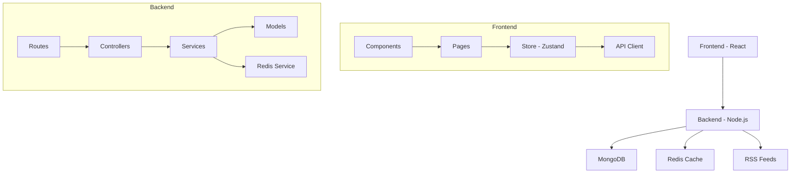

# RSS Reader Application

A modern MERN stack RSS feed reader application with real-time updates, caching, and user preferences.

## Architecture



## Project Structure

```
rss-reader/
├── frontend/                 # React frontend application
│   ├── public/              # Static files
│   ├── src/
│   │   ├── components/      # Reusable UI components
│   │   ├── pages/          # Page components
│   │   ├── store/          # Zustand store
│   │   ├── services/       # API services
│   │   ├── utils/          # Utility functions
│   │   └── App.js          # Main application component
│   └── package.json
│
├── backend/                 # Node.js backend application
│   ├── src/
│   │   ├── config/         # Configuration files
│   │   ├── controllers/    # Route controllers
│   │   ├── middleware/     # Custom middleware
│   │   ├── models/         # MongoDB models
│   │   ├── routes/         # API routes
│   │   ├── services/       # Business logic
│   │   ├── utils/          # Utility functions
│   │   └── server.js       # Application entry point
│   └── package.json
│
└── package.json            # Root package.json for workspace management
```

## Features

- User authentication and authorization
- RSS feed management (add, update, delete)
- Real-time feed updates
- Redis caching for improved performance
- Responsive Material-UI design
- Dark/Light theme support
- Feed item management (mark as read/unread)
- User preferences
- Image previews for feed items
- Feed categories and tags

## Prerequisites

- Node.js (v14 or higher)
- MongoDB
- Redis
- npm or yarn

## Environment Variables

### Backend (.env)
```
PORT=5000
MONGODB_URI=mongodb+srv://<username>:<password>@<cluster>.mongodb.net/<database>
JWT_SECRET=<your_jwt_secret>
REDIS_USERNAME=<redis_username>
REDIS_PASSWORD=<redis_password>
REDIS_HOST=<redis_host>
REDIS_PORT=<redis_port>
NODE_ENV=development
```

### Frontend (.env)
```
REACT_APP_API_URL=http://localhost:5000/api
```

## Installation

1. Clone the repository:
```bash
git clone <repository-url>
cd rss-reader
```

2. Install dependencies:
```bash
npm install
```

3. Set up environment variables:
- Copy `.env.example` to `.env` in both frontend and backend directories
- Update the variables with your values

## Running the Application

### Development Mode

1. Start both frontend and backend concurrently:
```bash
npm start
```

Or start them separately:
```bash
# Start backend
npm run start:backend

# Start frontend
npm run start:frontend
```

### Production Mode

1. Build the frontend:
```bash
npm run build
```

2. Start the backend:
```bash
cd backend
npm start
```

The application will be available at:
- Frontend: http://localhost:3000
- Backend API: http://localhost:5000

## Available Scripts

### Root Level
- `npm start` - Start both frontend and backend in development mode
- `npm run build` - Build the frontend for production
- `npm test` - Run tests for both frontend and backend
- `npm run lint` - Run ESLint on all files
- `npm run lint:fix` - Fix ESLint issues
- `npm run format` - Format code with Prettier

### Frontend
- `npm run start` - Start development server
- `npm run build` - Build for production
- `npm test` - Run tests
- `npm run lint` - Run ESLint
- `npm run lint:fix` - Fix ESLint issues
- `npm run format` - Format code with Prettier

### Backend
- `npm run start` - Start production server
- `npm run dev` - Start development server with nodemon
- `npm test` - Run tests
- `npm run lint` - Run ESLint
- `npm run lint:fix` - Fix ESLint issues
- `npm run format` - Format code with Prettier

## API Documentation

### Authentication
- POST /api/auth/register - Register a new user
- POST /api/auth/login - Login user
- GET /api/auth/me - Get current user

### Feeds
- GET /api/feeds - Get all feeds
- POST /api/feeds - Add new feed
- GET /api/feeds/:id - Get feed by ID
- PUT /api/feeds/:id - Update feed
- DELETE /api/feeds/:id - Delete feed
- PUT /api/feeds/:id/items/:itemId - Update feed item

### User Preferences
- GET /api/users/preferences - Get user preferences
- PUT /api/users/preferences - Update user preferences

## Contributing

1. Fork the repository
2. Create your feature branch
3. Commit your changes
4. Push to the branch
5. Create a new Pull Request

## License

This project is licensed under the MIT License - see the LICENSE file for details.

## Acknowledgments

- [Material-UI](https://mui.com/)
- [React](https://reactjs.org/)
- [MongoDB](https://www.mongodb.com/)
- [Express.js](https://expressjs.com/) 