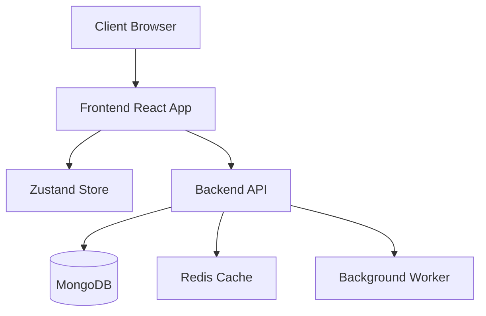
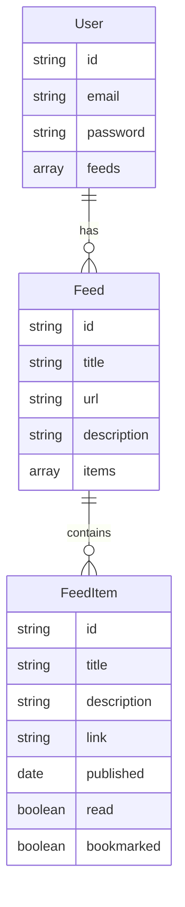

# RSS Reader Application Architecture

## Overview
The RSS Reader is a MERN stack application that allows users to subscribe to, read, and manage RSS feeds. The application follows a modern, component-based architecture with clear separation of concerns.

## System Architecture



## Frontend Architecture

### Component Structure
```
frontend/
├── src/
│   ├── components/         # Reusable UI components
│   ├── pages/             # Page components
│   ├── hooks/             # Custom React hooks
│   ├── store/             # State management
│   ├── services/          # API services
│   ├── utils/             # Utility functions
│   └── theme/             # Theme configuration
```

### State Management
- Uses Zustand for global state management
- Implements optimistic updates for better UX
- Maintains separate slices for different concerns:
  - Auth state
  - Feed state
  - UI state

### Routing
- Uses React Router v6
- Implements protected routes
- Supports dynamic routing for feed views

## Backend Architecture

### API Structure
```
backend/
├── src/
│   ├── controllers/       # Request handlers
│   ├── models/           # Database models
│   ├── routes/           # API routes
│   ├── services/         # Business logic
│   ├── middleware/       # Custom middleware
│   └── utils/            # Utility functions
```

### Database Schema


## Security
- JWT-based authentication
- Password hashing with bcrypt
- Rate limiting
- CORS configuration
- Input validation

## Performance
- Redis caching for feed data
- Background worker for feed updates
- Lazy loading of components
- Image optimization
- Pagination for feed items

## Development Guidelines

### Code Style
- Follow ESLint configuration
- Use Prettier for code formatting
- Follow React best practices
- Implement proper error handling
- Write meaningful comments

### Testing
- Unit tests for components
- Integration tests for API
- End-to-end tests for critical flows
- Test coverage requirements

### Deployment
- Docker containerization
- CI/CD pipeline
- Environment configuration
- Monitoring and logging

## API Documentation

### Authentication
- POST /api/auth/register
- POST /api/auth/login
- POST /api/auth/logout

### Feeds
- GET /api/feeds
- POST /api/feeds
- GET /api/feeds/:id
- PUT /api/feeds/:id
- DELETE /api/feeds/:id

### Feed Items
- GET /api/feeds/:id/items
- PUT /api/feeds/:id/items/:itemId
- POST /api/feeds/:id/items/:itemId/bookmark

## Environment Variables

### Frontend
```
REACT_APP_API_URL=http://localhost:5000
REACT_APP_ENV=development
```

### Backend
```
PORT=5000
MONGODB_URI=mongodb://localhost:27017/rss-reader
JWT_SECRET=your-secret-key
REDIS_URL=redis://localhost:6379
```

## Getting Started

1. Clone the repository
2. Install dependencies
3. Set up environment variables
4. Start development servers
5. Run tests
6. Build for production

## Contributing
1. Fork the repository
2. Create a feature branch
3. Commit changes
4. Push to the branch
5. Create a Pull Request

## License
MIT License 